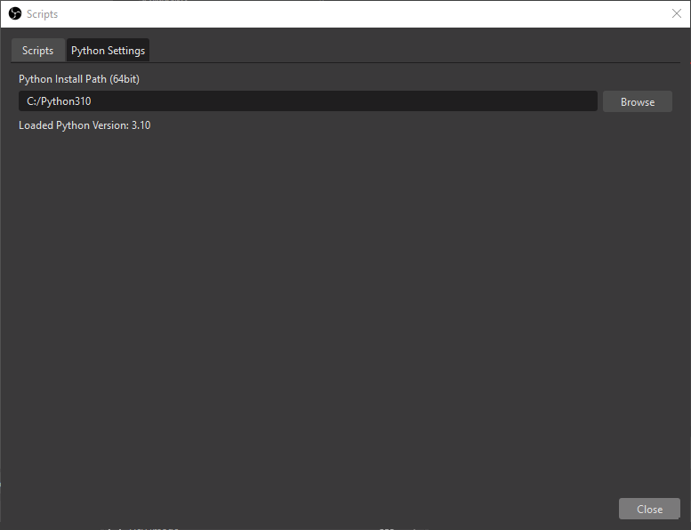
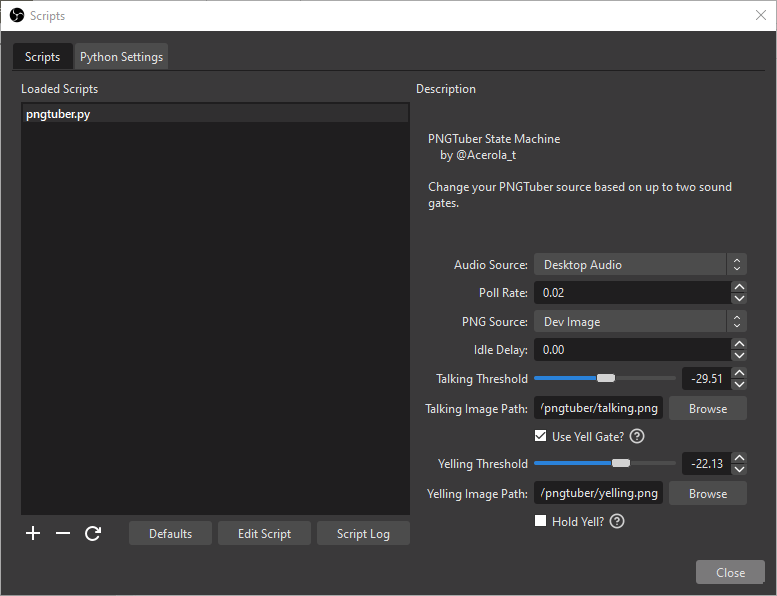

# Acerola's OBS Scripts

These are scripts I have made to assist my stream, feel free to use them yourself!

Download them [here](https://github.com/GarrettGunnell/obs-scripts/releases)

If you do use them, I'd love it if you would credit me so that others can easily find the same tool.

If you have issues please contact me here: https://twitter.com/Acerola_t or [Discord](https://discord.gg/FxGQvbfm6Y)

## Scripts

* [**PNGTuber State Machine**](https://github.com/GarrettGunnell/obs-scripts/tree/main/pngtuber) *(Windows Only)*
* * Animate your PNGTuber by swapping between sprites based on your mic volume as well as optional blinking sprites to bring your PNGTuber to life.
* * Customize how your PNGTuber moves during different states with different animation options.
* * * [Video Example](https://www.youtube.com/watch?v=G2TArVrOumQ&ab_channel=Acerola)
* * * [Video Tutorial]()

# How To Use

### Install Python

OBS does not natively come with a Python installation, so you have to do that!

Please go [here](https://www.python.org/downloads/release/python-31010/) and scroll to the bottom and download the `Windows installer (64-bit)`.

Take note of the location you install Python to. For me, this location is `C:\Python310\`.

### OBS Python Settings

Open OBS and in the top bar click `Tools` -> `Scripts`.

This will open a window with two tabs. Navigate to `Python Settings` and enter the path to your Python installation that you took note of earlier.

It should look like this:

### Activate Script

Then in the same window navigate to `Scripts`.

To use one of my scripts you have to download it, so make sure you have the script file in an easy to access location. In the bottom left of the `Scripts` window there is a large + sign. Click the plus sign and navigate to the script file and confirm.

This will load the script into OBS and you're all finished!

### Script Explanation

For a more in depth explanation of the script and what the options do, please refer to the folder of the script you downloaded like [this](https://github.com/GarrettGunnell/obs-scripts/tree/main/pngtuber) one for example.

## Disclaimer

OBS scripts can be a little strange and OBS clearly doesn't prioritize their support very much. This means that scripts may cause unexpected crashes in weird fringe scenarios, but it shouldn't be much of a concern.

If you experience frequent crashing, then your OBS is most likely out of date and you should update it.